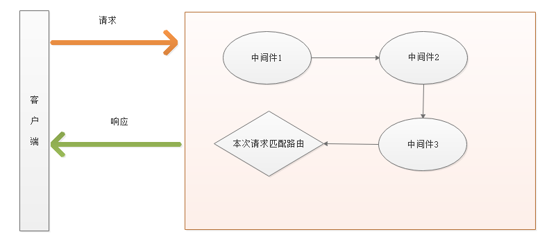

# 中间件

## 含义

中间件（middleware）可以理解为业务流程的中间处理环节。如生活中吃一般炒青菜，大约分为如下几步骤：


express 中，当一个**请求到达的服务器之后，可以在给客户响应之前**连续调用**多个**中间件，来对本次请求和返回响应数据进行**处理**。



中间件的本质是传递给 express 的一个回调函数

这个回调函数接受三个参数：

- 请求对象（request 对象）
- 响应对象（response 对象）
- next 函数（在 express 中定义的用于执行下一个中间件的函数）

## 中间件作用

- 执行任何代码
- 更改请求（request）和响应（response）对象
- 结束请求-响应周期（返回数据）
- 调用栈中的下一个中间件

如果当前中间件功能没有结束请求-响应周期，则必须调用 next()将控制权传递给下一个中间件功能，否则，请求将被挂起

## 中间件的分类

中间件可以分类可分如下几类：

1. 内置中间件，也就是 express 本身自带无需 npm 安装
2. 第三方中间件
3. 自定义中间件，开发者自己编写的（**中间件的本质其实就是一个函数**）

如果从使用层面去考虑，中间件可以划分为：

1. 应用级别中间件（通过 app.get/post/use 等方法绑定到 app 实例的中间件）
2. 路由级别中间件（绑定到 express.Router()上的中间件）

## use 最基本用法

express 主要提供了两种方式：

- app/router.use
- app/router.methods

可以是 app，也可以是 router

- 通过 use 方法注册的中间件是最普通的/简单的中间件
- 通过 use 注册的中间件, 无论是什么请求方式都可以匹配上
- methods 指的是常用的请求方式，比如： app.get 或 app.post 等

```js
// 1.注册普通的中间件
app.use((req, res, next) => {
  console.log("normal middleware 01");
  next();
});
```

### use 匹配路径

```js
// 2.注册路径匹配的中间件：路径匹配的中间件是不会对请求方式(method)进行限制
app.use("/home", (req, res, next) => {
  res.end("home data");
});
```

### 指定请求方法注册中间件

```js
// 3.注册中间件: 对path/method都有限制
// app.method(path, middleware)
app.get("/home", (req, res, next) => {
  console.log("match /home get method middleware");
  res.end("home data");
});
app.post("/users", (req, res, next) => {
  console.log("match /users post method middleware");
  res.end("create user success");
});
```

### 注册多个中间件

可以将不同的功能拆分成中间件，例如

1. 验证身份
2. 查询数据库
3. 返回数据

```js
// 4.注册多个中间件
// app.get(路径, 中间件1, 中间件2, 中间件3)
app.get(
  "/home",
  (req, res, next) => {
    console.log("match /home get middleware01");
    next(); //要想后面的中间件需要调用next
  },
  (req, res, next) => {
    console.log("match /home get middleware02");
    next();
  },
  (req, res, next) => {
    console.log("match /home get middleware03");
    next();
  },
  (req, res, next) => {
    console.log("match /home get middleware04");
  }
);
```

## 解析 body 参数

在客户端发送 post 请求时，会将数据放到 body 中：

- 客户端可以通过 json 的方式传递
- 也可以通过 form 表单的方式传递

### express.json()

express.json 是 express 内置中间件，可以用来处理 json 数据，对 body 进行解析

```js
app.use(express.json());

// 该中间件相当于做了一下操作

//处理请求的json数据
app.use((req, res, next) => {
  if (req.headers["content-type"] === "application/json") {
    req.on("data", (data) => {
      const jsonInfo = JSON.parse(data.toString());
      req.body = jsonInfo;
    });

    req.on("end", () => {
      next();
    });
  } else {
    next();
  }
});
```

### express.urlencoded()

解析传递过来 urlencoded 的时候,可以使用 express 内置的中间件或者使用 body-parser 来完成

- 默认使用的 node 内置 querystring 模块（有点过时了）
- 可以使用 express.urlencoded 中间件，使用第三方 qs 库（推荐）

```js
app.use(express.json()); // 解析客户端传递过来的json

app.use(express.urlencoded({ extended: true })); // 解析客户端传递过来的urlencoded
// 解析传递过来urlencoded的时候, 默认使用的node内置querystring模块
// { extended: true }: 代表不再使用内置的querystring, 而是使用qs第三方库
```

## 记录请求日志中间件 morgan

可以使用 express 官网开发的第三方库 morgan 将请求日志记录下来

```bash
npm i morgan
```

```js
const morgan = require("morgan");
// 创建app对象
const app = express();
const fs = require("fs");

// 应用第三方中间件
const writeStream = fs.createWriteStream("./logs/access.log");
app.use(morgan("combined", { stream: writeStream }));
```

## 文件上传中间件 multer()

可以使用 express 提供的中间件 multer 来完成上传文件

```bash
npm i multer
```

```js
const multer = require("multer");
// 应用一个express编写第三方的中间件
const upload = multer({
  // dest: "./uploads", //指定上传文件保存的路径
  storage: multer.diskStorage({
    //目的文件夹
    destination(req, file, callback) {
      callback(null, "./uploads");
    },
    //对文件名进行处理，添加后缀名，自定义文件名等
    filename(req, file, callback) {
      callback(null, Date.now() + "_" + file.originalname);
    },
  }),
});
// 上传单文件: singer方法
app.post("/avatar", upload.single("avatar"), (req, res, next) => {
  console.log(req.file);
  res.end("头像文件上传成功~");
});
// 上传多文件:array方法
app.post("/photos", upload.array("photos"), (req, res, next) => {
  console.log(req.files);
  res.end("上传多张照片成功~");
});
```

### multer()解析 form-data

multer 帮助我们解析一些 form-data 中的普通数据，使用 any

```js
const formdata = multer();

app.post("/login", formdata.any(), (req, res, next) => {
  console.log(req.body);
  res.end("登录成功, 欢迎回来~");
});
```

## 客户端发送请求传递参数

客户端传递到服务器参数的方法常见的是 5 种

1. 方式一：通过 get 请求中的 URL 的 params
2. 方式二：通过 get 请求中的 URL 的 query
3. 方式三：通过 post 请求中的 body 的 json 格式(用 express.json 中间件)
4. 方式四：通过 post 请求中的 body 的 x-www-form-urlencoded 格式(用 express.urlencoded()中间件)
5. 方式五：通过 post 请求中的 form-data 格式(用 multer 中间件)

### 传递参数 params 和 query

```js
// http://localhost:8000/login/123/abc
app.use("/login/:id/:name", (req, res, next) => {
  console.log(req.params);
  res.json("请求成功");
});
// http://localhost:8000/login?name=abc&id=123
app.use("/login", (req, res, next) => {
  console.log(req.query);
  res.json("请求成功");
});
```

## 响应数据

1. end 方法：类似于 http 中的 response.end 方法，用法是一致的
2. json 方法：可以传入很多的类型：object、array、string、boolean、number、null 等，它们会被转换成 json 格式返回
3. status 方法：用于设置状态码，注意是一个函数，而不是属性赋值

```js
// 编写中间件
app.post("/login", (req, res, next) => {
  // 1.res.end方法(比较少)
  res.end("登录成功, 欢迎回来~");

  // 2.res.json方法(最多)
  res.json({
    code: 0,
    message: "欢迎回来~",
    list: [
      { name: "a", id: 1 },
      { name: "b", id: 2 },
      { name: "c", id: 3 },
      { name: "d", id: 4 },
    ],
  });

  // 3.res.status方法: 设置http状态码
  res.status(201);
  res.json("创建用户成功~");
});
```

## 小结

在 express 中使用中间件时，需要注意以下几点：

- 在定义路由**之前**注册中间件（除了错误中间件）
- 一个请求中可以连续调用多个中间件
- 在一次请求链路中，多个中间件与最终路由方法中，他们共用一份`req`与`res`
- 每个中间件最后必须调用`next()`（除了错误中间件，必须要有参数传递）
- 不要在中间件的`next()`后继续写任何代码（没意义）
