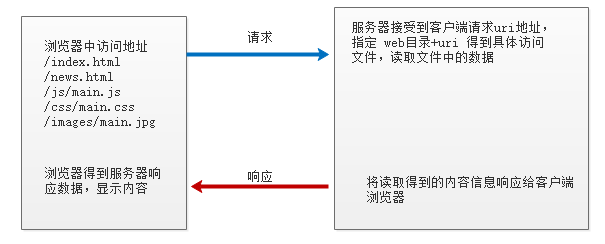

# http 模块

http 模块是用来创建 web 服务器。

## 1.服务器

给用户提供的服务的机器就是服务器，在服务器上需要安装服务器软件，目前最主流的 3 个 web 服务器软件是 Apache,Nginx,IIS。

用户从浏览器打开页面最终呈现在屏幕上，经历了哪些事？

- 首先用户需要联网
- 用户根据 url 请求，DNS 将 url 中的域名解析成 ip 地址
- 根据地址等请求信息找对应的服务器
- 后端可能会用到数据库，服务器会从数据库拿到数据，再从服务器通过网络呈现到浏览器上。

## 2.开发模式

现在一般主要有前后端分离和前后端耦合开发 2 种模式。

1. 前后端分离：提出需求-设计接口约定数据（接口文档）-前后端并行开发-前后端集成-前端调整页面-集成成功-交付
2. 前后端耦合开发：提出需求-前端开发页面-后端编译成模板-前后端对接（需要相互看彼此的代码）-集成遇到问题-前端返工-后端返工-二次集成-集成成功-交付

现在主要是使用前后端分离开发，不过要是懂后端语言耦合开发也不错。

## 3.服务器相关的概念

### 3.1ip 地址

**ip 地址**：ip 地址有 v4 和 v6 之分，IP 地址就是互联网上每台计算机/电子设备的唯一地址，因此 IP 地址具有唯一性。在开发期间，自己的电脑既是一台服务器，也是一个客户端，可以在本机浏览器中输入**127.0.0.1**进行访问。

### 3.2 域名

**域名**：尽管 IP 地址能够唯一地标记网络上的计算机，但 IP 地址是一长串数字，不直观，而且不便于记忆，于是人们又发明了另一套字符型的地址方案，叫**域名地址**。IP 地址和域名是一一对应的关系，这份对应关系存放在一种叫做**域名服务器**(**DNS**)的电脑中。在开发测试期间，**127.0.0.1 对应的域名是 localhost**。

> 本地如果 localhost 无法使用，则是因为本机中的 hosts 文件中没有匹配上 ip 地址

### 3.3 网络协议

**网络协议** ：网络上的计算机之间交换信息，就像我们说话用某种语言一样，在网络上的各台计算机之间也有一种语言，这就是网络协议，**不同的计算机之间必须使用相同的网络协议才能进行通信**。如：TCP、UDP、HTTP、FTP 等等。

### 3.4 端口号

**端口号**：服务器的端口号就像是现实生活中的门牌号一样。通过门牌号，外卖员就可以准确把外卖送到你的手中。同样的道理，在一台电脑中，可以运行 N 多个 web 服务。每个 web 服务都对应一个唯一的端口号（0-65535，2^16，常见的端口号别占用：20,21,22,25,80,443,3306,3389,11211,27017....）。客户端发送过来的网络请求，通过端口号，可以被准确地交给对应的 web 服务进行处理。0-65535

> 注：服务器上的端口号是不可以重复的，必须是独一无二。**http 服务默认端口号为 80，https 的端口号默认是 443。**

## 4.创建 web 服务器

NodeJs 是通过官方提供的 http 模块来创建 web 服务器的模块。通过几行简单的代码，就能轻松的手写一个 web 服务，从而对外提供 web 服务。

1. 导入 http 模块
2. 创建 web 服务对象实例
3. 绑定监听客户端请求事件 request
4. 监听端口，启动服务

```js
// 导入http模块
const http = require("http");
// 创建web服务对象实例
const server = http.createServer();
// 绑定监听客户端请求事件request
server.on("request", (request, response) => {});

// request: 接受客户端请求对象，它包含了与客户端相关的数据和属性
//      request.url      客户端请求的uri地址
//      request.method  客户端请求的方式 get或post
//      request.headers   客户端请求头信息(对象)
//      ....
// response:服务器对客户端的响应对象
//     设置响应头信息 ，用于响应时有中文时乱码解决处理
//     response.setHeader('content-type', 'text/html;charset=utf-8')
//     设置状态码（常见的HTTP状态码有：200，404，301、302、304、403、401、405、500，502）
//     response.statusCode = 200
//     向客户端发送响应数据,并结束本次请求的处理过程
//     response.end('hello world')
// 启动服务
server.listen(8080, () => {
  console.log("服务已启动");
});
```

**手写一个服务器软件，启动后要求用户访问根“/”输出`hello world`，用户访问`/html5`输出`2004`。**

```js
// 1. 导入http模块
const http = require("http");

// 2. 创建web服务实例
const server = http.createServer();

// 3. 监听request请求
server.on("request", (req, res) => {
  // 输出hello world
  // res.end("hello world");
  if (req.url === "/") {
    res.end("hello world");
  }
  if (req.url === "/html5") {
    res.end("2004");
  }
});

// 4. 启动服务
server.listen(8080, () => {
  // 仅是提示作用，可以不写，但是建议写
  console.log("server is running at http://127.0.0.1:8080");
});
```

## 5.静态资源服务器

静态资源：常见的有 html、css、js、图片、音频、视频等

静态资源服务器：专门保存上述静态资源的服务器，称之为静态资源服务器。

为什么要将静态资源和动态资源分开放，静态资源一般需要高带宽，而后端资源一般不需要较大的资源，主要是为了提升静态资源的访问速度。

**手写静态资源服务器实现思路**：

客户端请求的每个资源 uri 地址，作为在本机服务器指定目录中的文件。通过相关模块进行读取文件中数据进行响应给客户端，从而实现静态服务器。



**实现步骤:**

需求：使用 nodejs 的 http 模块创建静态资源服务器，专门存放静态资源展示 2 张图片

```js
// 创建服务器有以下几步：
//  a. 导入
const http = require("http");
const path = require("path");
const fs = require("fs");
//  b. 创建web实例
const server = http.createServer();
//  c. 监听request事件
server.on("request", (req, res) => {
  // 获取当前用户访问的资源路径
  let uri = req.url;
  // 由于“/”没有实体资源，需要将“/”做处理，如果访问“/”则让其对应访问“/index.html”
  if (uri == "/") {
    uri = "/index.html";
  }
  // 默认情况下，浏览器在第一次请求网站的时候会访问“/favicon.ico”图标文件，如果没有也会出现404
  // 如果需要解决这个问题，则有3种方式：
  // 方式1：去找个ico文件，存放在静态资源的public目录下，命名为“favicon.ico”
  // 方式2：在处理的时候忽略“/favicon.ico”文件的处理，也就是下面的加了判断的写法
  // 方式3：不管，不用处理，其不影响页面的显示
  if (uri != "/favicon.ico") {
    // 读取文件（fs模块），将内容返回给用户（res.end）
    let filename = path.join("public", uri);
    // 判断文件是否存在
    if (fs.existsSync(filename)) {
      fs.readFile(filename, (err, data) => {
        if (!err) {
          // ok
          res.end(data);
        } else {
          // 不ok
          res.setHeader("Content-Type", "text/html;charset=utf-8");
          res.statusCode = 500;
          res.end("请求资源出现错误。。。");
        }
      });
    } else {
      res.setHeader("Content-Type", "text/html;charset=utf-8");
      res.statusCode = 404;
      res.end("你要找的资源失踪了。。。");
    }
  }
});
//  d. 监听端口，启动服务
server.listen(8080, () => {
  console.log("server is running at http://127.0.0.1:8080");
});
```

## 6.get 数据获取

get 数据通过地址栏使用 query 方式进行传递的数据 例

```js
?id=1&name=zhangsan
```

查询字符串的规则：请求参数使用 URL 地址和“问号传参“ 的方式进行传递----用问号把 url 和请求参数分开。

```js
// 导入
const http = require("http");
const url = require("url");
// 创建实例&监听request事件&监听端口
http
  .createServer((req, res) => {
    //  之前第3步中的回调函数
    // 获取地址栏中 query数据
    let { query } = url.parse(req.url, true);
    console.log(query);
  })
  .listen(8080);
```

## 7.post 数据获取

当请求方式不是 get（大部分情况是 post 或 put）时，那么请求的数据不是在 url 上，而是在请求体里。chrome 浏览器针对不同的 content-type 有做了区分，分别是 formData 和 request payload。

表单数据多数为 post 进行提交到服务器端。需要监听 req 对象的 data 事件来获取客户端发送到服务器的数据。如果数据量比较大，无法一次性发送完毕，则客户端会把数据切割后分批次发送给服务器。所以 data 事件可能会被触发多次，每次触发 data 事件时，收到的数据只是全部数据的一部分，因此需要做数据的拼接才能得到完整的数据：

```js
const http = require("http");
const queryString = require("querystring");
http
  .createServer((req, res) => {
    let arr = [];
    // 数据接受中
    req.on("data", (buffer) => {
      arr.push(buffer);
    });
    // 数据传输结束了
    req.on("end", () => {
      // 拼接接受到的所有数据
      let buffer = Buffer.concat(arr);
      let post = queryString.parse(buffer.toString());
      console.log(post);
    });
  })
  .listen(8080);
```
