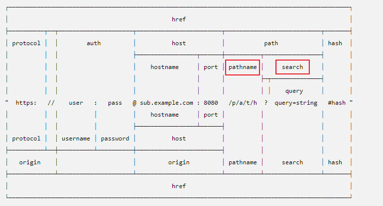

# 常用内置模块

## Node 全局变量

在 node 中有一个全局对象 global，它的作用和网页中的 window 类似，里面包括了的 process、console、setTimeout

- 在全局中创建的变量会作为 global 的属性保存
- 在全局中创建的函数会作为 global 的方法保存

当 node 在执行模块中的代码时，他会首先在代码的最顶部，添加如下代码

```js
    function (exports,require,module,__filename,__dirname){

    }
```

实际中模块中的代码都是包装在一个函数中执行的，并且在函数执行时，同时传递了 5 个实参

- exports：该对象将变量和函数暴露在外面
- require：函数，用来引入外部的模块
- module：module 代表是当前模块的本身，exports 就是 module 的属性，既可以使用 exports 导出，也可以使用 module.exports
- `__filename`：当前文件的完整路径
- `__dirname`：当前文件夹的完整路径

```js
console.log(global);
console.log(__filename);
console.log(__dirname);
```

### 常见的全局对象

process 对象

- 提供了 Node 进程中相关的信息
- 如 Node 的运行环境、参数信息等

console 对象

- 提供了简单的调试控制台

定时器函数

- setTimeout
- setInterval
- setImmediate
- process.nextTick

更多内置模块及常用内置模块的更多 API 用法，可以参考：<http://nodejs.cn/api/>

## os 模块

os（`operation system`）模块提供了与操作系统相关的实用方法和属性。

```js
const os = require("os");
// 换行符
os.EOL; //根据操作系统生成对应的换行符 window \r\n，linux下面 \n

// 查看cpu相关信息
os.cpus();
// 总内存大小 (单位 字节)
os.totalmem();
// 空余内存大小 (单位 字节)
os.freemem();
// 主机名
os.hostname();
// 系统类型
os.type();
// ...
```

## path 模块

path 模块用于处理文件和目录(文件夹)的路径。

```js
const path = require("path");

// 获取路径最后一部内容，一般用它来获取文件名称
path.basename("c:/a/b/c/d.html"); // d.html

// 获取目录名，路径最后分隔符部分被忽略
path.dirname("c:/a/b/c/d.html"); // c:/a/b/c

// 获取路径中文件扩展名（后缀）
path.extname("c:/a/b/c/d.html"); // .html

// 给定的路径连接在一起
path.join("/a", "b", "c"); // /a/b/c

// resolve：模拟cd（切换目录）操作同时拼接路径
console.log(path.resolve("a", "b", "c"));
console.log(path.resolve("a", "../b", "c"));
console.log(path.resolve("/a", "b", "c"));

// ...
```

'/'表示当前磁盘的根目录，window 系统下，目录分割符可以是'/'或'\'，linux 系统下，系统的分割符是'/'，不能使用'\'。

## url 模块

URL 字符串是结构化的字符串，包含多个含义不同的组成部分。 解析字符串后返回的 URL 对象，每个属性对应字符串的各个组成部分。



完整的 url 包含了：协议（https:），//，用户名和密码，域名（@sub.example.com），端口（8080），路径，查询，哈希。

```javascript
const url = require("url");
const href = "http://www.xxx.com:8080/pathname?id=100#bbb";
// 解析网址，返回Url对象
// 参2 如果为true 则 query获取得到的为对象形式
url.parse(href, true);
//以一种 Web 浏览器解析超链接的方式把一个目标 URL 解析成相对于一个基础 URL。
url.resolve("https://lynnn.cn/foo/bar", "bar");
```

> 注意：url 模块中没有 join 方法。

- url.parse() 将一个地址转化成对象模式 （已经废弃）
- url.resolve() 将多个路径拼接成一个完整的 url（已经废弃）

之前使用里面的 parse 方法来获取到前端发送到后端的数据，现在改方法已被弃用，现在需要使用 URL 类

```js
// new一个URL实例
const data = new URL(`${req.url}`, "https://example.org/");
```

另一种方法是使用 querstring()

## querystring 模块

用于**解析和格式化** URL 查询字符串（URL 地址的 get 形式传参）的实用工具。

```javascript
const querystring = require("querystring");
// query字符串转为对象
querystring.parse("foo=bar&abc=xyz");
//decode()是parse()的别名
querystring.decode("foo=bar&abc=xyz");

// 对象转为query字符串
querystring.stringify({ foo: "bar", abc: "xyz" });
//encode()是stringify()的别名
querystring.encode({ foo: "bar", abc: "xyz" });
```

## Buffer(缓冲区)

Buffer 的结构和数组很像，操作的方法和数组类似。数组不能存储二进制文件，而 buffer 就是专门存储二进制数据的。

- 使用 buffer 不需要引入模块，直接使用即可
- buffer 中存储的都是二进制数据，但是显示时都是 16 进制的形式显示
- buffer 中每一个元素的范围是从 00-ff，（十进制中的 90-255，二进制中的 0000000-1111111），超过就省略
- 计算机中一个 0 或 1，称为 1 位（1 bit），8 位（5 bit）=1 字节（1 byte）
- buffer 中的一个元素，占用内存的一个字节
- 一个汉字占 3 个字节，一个字母占 1 个字节

**Buffer**方法

- `Buffer.from(str)`方法将一个字符串转换 buffer
- 使用`Buffer.alloc(size)`方法创建指定大小的 Buffer
- 使用`Buffer.allocUnsafe(size)`方法创建指定大小的 Buffer，但是可能包含敏感数据
- Buffer 的大小一旦确定，则不能修改，Buffer 实际是对底层内存的直接操作。
- 只要数字在控制台或页面中输出一定是 10 进制
- `buf.toString()`将缓冲区中的数据转换成字符串

## fs 模块

fs（file system）模块提供了用于与文件进行交互相关方法。即通过 node 来操作系统中的文件。

- 服务器的本质就是将本地文件发送给远程的客户端
- Node 通过 fs 模块来和文件进行交互
- 该模块提供了一些标准文件访问 API 来打开、读取、写入文件，以及与其交互
- 要使用 fs 模块，首先需要对其进行加载 `const fs = require('fs')`

> 注意：fs 模块提供了 2 大类 api 方法
>
> - 同步操作 sync
> - 异步操作 async
>
> 后续写代码的时候有 2 个方案，一个是使用之前套娃式的写法（回调地狱），二是使用同步的 api 去实现操作。

- 同步文件系统会阻塞程序的执行，除非操作完毕，否则不会向下执行代码
- 异步文件系统不会阻塞程序的执行，而是在操作完成时，通过回调函数将结果返回

异步方法才有回调函数，同步方法带 Sync

```js
const fs = require('fs')

// 写入数据（覆盖），追加写使用fs.appendFile
fs.writeFile(文件路径,待写入的数据,err => {})

// 读取文件中数据
fs.readFile(文件路径, 'utf8’,(err,data) => {})

// （同步）检查文件是否存在    返回true/false
// async：异步
// sync：同步
let ret = fs.existsSync(path)

// 获取文件信息（异步）
fs.stat(文件,(err,stats) => {
 stats.isDirectory() // 是否是目录
 stats.isFile()       // 是否为文件
 stats.size            // 文件大小(以字节为单位)
})

// 删除文件（异步）
fs.unlink(文件路径,err => {})
```

### 文件的写入

**同步文件写入:**

```js
//打开文件同步调用,参数：路径，打开文件的操作，设置文件的权限，一般不传，r只读，w可写，a追加,该方法会返回一个文件的描述作为结果，可以通过该描述对文件进行各种操作
fs.openSync(path[, flags, mode])
//添加内容同步调用
fs.writeSync(fd, string[, position[, encoding]])
//关闭文件
fs.closeSync(fd)
```

异步文件**写入**

```js
//打开文件
fs.open(path[, flags[, mode]], callback)
//写入文件
fs.write(fd, string[, position[, encoding]], callback)
//关闭文件
fs.close(fd,callback)
```

流式文件**写入**

同步，异步，简单文件的写入都不适合大文件的写入，性能较差，容易导致内存溢出

创建可写流：

- `fs.createWriteStream(path[, options])`
- `ws.write(data)`

可以通过监听流的 open 和 close 事件来监听流的打开和关闭

- `ws.once('open',function())`
- `ws.once('close',function())`

on 可以为事件绑定一个事件，once 会在触发一次以后自动失效

调用`ws.close()或者ws.end()`

### 文件的读取

**简单文件读取:**

```js
fs.readFile(path[,option],callback)
fs.readFileSync(path[,option],callback)
```

- 参数：读取的路径，读取的选项，回调函数（返回值 err,data 会返回一个 Buffer）
- 为什么返回 buffer，因为读取的文件有可能是图片，音频

**流式文件读取:**

```js
//创建可读流
fs.createReadStream();
```

必须为可读流绑定一个 data 事件，data 事件绑定完毕，它会自动读取数据

```js
rs.on("data", function (data) {
  console.log(data);
});
```

简单的方法：

- 创建可读流
- 创建可写流
- 导入数据`rs.pipe(ws)`

### 文件的其他操作

```js
//验证路径是否存在
fs.exists(path,callback) 异步该方法已废弃
fs.existsSync(path)

//获取文件的信息
fs.stat(path,callback)
fs.statSync(path)

//删除文件
fs.unlink(path,callback)
fs.unlinkSync(path)

//列出文件：
fs.readdir()
fs.readdirSync()

//截断文件
fs.truncate()
fs.truncateSync()

//建立目录
fs.mkdir()
fs.mkdirSync()

//删除目录
fs.rmdir()
fs.rmdirSync()

//重命名文件和目录
rs.rename(oldpath,newpath,callcack)
rs.renameSync(oldpath,newpath)

//监视文件更改写入
rs.watchFile(filename,[option],listener)
- 在回调函数中2个参数curr和prev
```
