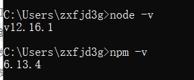
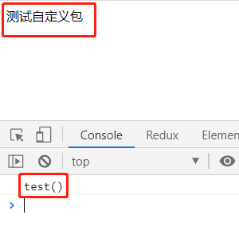

# 创建工具包项目

## 安装 Node

- 检查是否已经安装 node(node 中自带 npm)



- 如果 node 与 npm 命令不识别，说明你还没有安装 node
- 安装 node

## 创建项目

```bash
# 创建一个空的项目文件夹: hqs-utils
# 在文件夹下执行命令
npm init -y
```

## 下载依赖包

```bash
npm i webpack webpack-cli
```

## 配置 webpack

- `webpack.config.js`

```js
const path = require("path");
module.exports = {
  // 模式
  mode: "development", // 也可以使用 production
  // 入口
  entry: "./src/index.js",
  // 出口
  output: {
    // 打包文件夹
    path: path.resolve(__dirname, "dist"),
    // 打包文件
    filename: "hqs-utils.js",
    // 向外暴露的对象的名称
    library: "utils",
    // 打包生成库可以通过esm/commonjs/requirejs的语法引入
    libraryTarget: "umd",
  },
};
```

## 在入口 JS 中暴露功能

- `src/index.js`

```js
export function test() {
  document.write("测试自定义包");
  console.log("test()");
}
```

## 配置打包命令

- `package.json`

```json
"scripts": {
  "build:watch": "webpack --watch"
},
```

## 对项目进行打包

```bash
npm run build:watch
```

## 测试使用自定义包

- `test/first.html`

```html
<body>
  <script src="../dist/hqs-utils.js"></script>
  <script>
    aUtils.test();
  </script>
</body>
```


